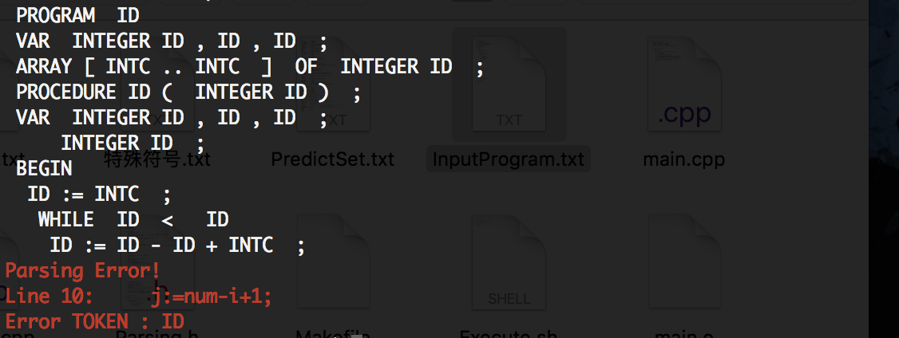
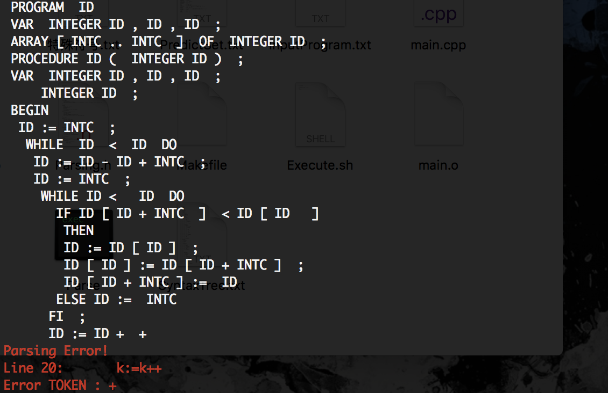
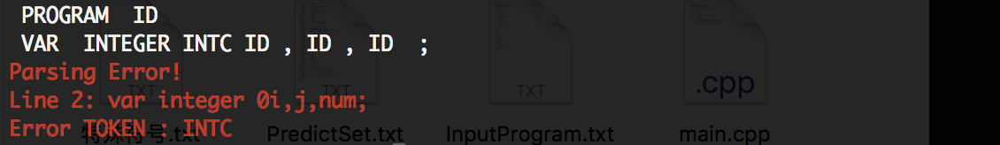

# **编译原理实验报告**

###  姓名：爸爸    学号：XXXXXX

### 运行方法：  

* 在Code目录下    ./Execute.sh
* 或者直接在Code下：make clean， make

### 修改输入：

* 在文件 “InputProgram.txt”修改输入

### 文件输出：

* 在terminal输出词法分析结果
* 如果有语法错误，则在terminal中高亮输出错误的行号，以及错误的TOKEN
* 语法树输出：可根据main.cpp中注释修改main.cpp控制是否在terminal中输出语法树及参考线，默认直接输出到文件“SyntaxTree.txt”中，并且有参考线

### 实验平台：Mac OSX/Linux   C++环境：C++11

###   实验目标：设计并实现SNL程序设计语言的词法分析程序和语法分析(递归下降)程序

* 了解SNL语言的词法和语法 
* 设计词法分析和语法分析的接口 
* 设计Token和抽象语法树的数据结构 
* 设计并编写词法分析程序 
* 设计并编写语法分析程序  
* 设计并实现词法错误和语法错误的识别和处理算法

### 实验相关数据结构

* #### 设计Token的数据结构如下：

```c++
struct TOKEN {
	std::string type;//类别
	std::string* semantic = nullptr;
	TOKEN(std::string mType = "UNKNOW", std::string* mSemantic = nullptr): type(mType), 	semantic(mSemantic) {}
};
```

* #### 设计语法树的数据结构如下： 【父亲节点，【儿子节点，儿子节点，儿子节点】】

```c++
struct TreeNode {
	std::string symbol = "";              //节点对应的TOKEN
	int son_Cnt = 0;                      //子节点数量
	TreeNode* father  = nullptr;          //父节点指针
	std::vector<TreeNode*> son;           //子节点指针
	TreeNode(){}												
	TreeNode(std::string mSymbol):symbol(mSymbol){}
	void print(int tab, bool flag);       //输出当前节点，tab表示缩进，falg为是否输出参考线
	void save(std::ofstream& fout, int tab, bool flag);       //将节点写到文件
	void deleteAllSon();                  //递归删除整棵树占用的空间 
};
```

### 具体实验步骤

#### **1.** **词法分析：**

构造DFA自动机并封装好，为了保证代码的封装性，DFA类对用户不可见，其作为单例模式由Lexer类调用，通过Lexer来调用词法分析程序。

* DFA构造过程：
  * 特殊符号、字符串，字符：直接显示的在自动机中构造。
  * 保留字：保留字构成的链，如果在中间跳出或者其他字母和数字，则直接通过特判函数跳到ID类型所对应的相应的节点中，如idAlpha和idNum节点。
  * 标识符：构造俩节点idAlpha和idNum，根据当前字符类型特判在连个节点直接转换。
* DFA识别一个word所对应的TOKEN：
  * 一个word从DFA的根节点开始走，走到word字符被遍历完，若当前状态可终止则返回节点上对应的TOKEN，否则返回UNKWON，若word在自动机上不能走完，则直接返回ERROR
* DFA识别一串TOKEN（通常是一行程序输入str）：
  * Str从DFA的根节点开始走，一直走到无路可走，若当前节点可终止，返回当前节点相应的TOKEN，剩下的字符串重新从根节点开始匹配；如果当前节点不可终止则直接返回UNKWON

**注：虽然返回由UNKWON和ERROR两种类型，实际处理过程中都作为错误词法处理。**

* Lexer工作方式；
  * 查询某个word的TOKEN：直接调用DFA识别单个词的TOKEN的方法
  * 得到下一个词语的TOKEN：Lexer现将整段代码读入，然后每次收到请求需要返回下一个word的TOKEN的时候，先看Lexer类中的缓冲队列TOKEN_queue是否为空如果不为空，直接返回头部的TOKEN，否则将当前行的代码输入到DFA中，得到一串TOKEN存入缓冲队列TOKEN_queue中；然后返回缓冲队列头部的TOKEN。

构造DFA自动机并封装，用词法分析函数进行调用。在DFA自动机中，用一个bool类型判断当前类型是否可以转换为标识符，当无边可去时退出自动机。使用时，逐行用文件里读取代码，处理完一行之后，继续读取下一行。重复上述步骤，直至完成所有的词法分析，得到Token序列。

#### **2.** **求prediction集：**

根据：

First( β ) = {a ∈ V T | β ⇒ * a ......} ∪ (if β ⇒ * ε then{ε} else ¢)

Follow(A) = {a ∈ V T | S ⇒ + ......Aa......} ∪ (if S ⇒ * ......A then{#} else ¢)

Predict(A →β)  =  First(β)  =  First(β) – {ε} ∪ Follow(A)

编写辅助程序，通过循环迭代直到集合收敛来对predict集合进行求解，并将predict集存入文件，主题程序语法分析的时，不需要重复求解，直接从文件读入即可。

#### **3.** **语法分析（递归下降）：**

递归下降的程序都是有规律的，编写一个ProgramMaker的辅助程序来生成递归下降的代码。

ProgramMaker工作方式：

先读入2中辅助程序求得的predictSet，然后读入整理好格式更好处理的文法表达式（用辅助函数tidy（）来整理文发表达式），并在读入表达式时，将符号分成终结符和未终结符。

对于每个非终结符推导出的一系列文法表达式调用函数oneGroupExpMaker()；在oneGroupExpMaker()函数中，对该非终结符的每一条表达式，调用oneExpMaker()，对每条表达式进行处理；对于每条表达式根据其predictSet和其predict的字符是非终结符还是终结符来调用递归下降程序和match程序。

在递归下降的同时构造语法树，因为递归下降相当于在语法树上先根遍历，所以只需要先根遍历递归生成语法树就可以了。

### 实验结果 

#### 样例1:正样例

* 输入

  ```pascal
  program bubble
  var integer i,j,num;
  array [1..20] of integer a;
  procedure q(integer num);
  var integer i,j,k;
      integer t;
  begin
    i:=1;
    while i < num do
      j:=num-i+1;
      k:=1;
      while k<j  do
        if a[k+1] < a[k]
        then
          t:=a[k];
          a[k]:=a[k+1];
          a[k+1]:=t
        else temp:=0
        fi;
        k:=k+1
      endwh;
      i:=i+1
    endwh
  end
  
  begin
    read(num);
    i:=1;
    while i<(num+1)  do
      read(j);
      a[i]:=j;
      i:=i+1
    endwh;
    q(num);
    i:=1;
    while i<(num+1) do
        write(a[i]);
        i:=i+1
    endwh
  end.
  ```

* 输出

  ```shell
   PROGRAM  ID 
   VAR  INTEGER ID , ID , ID  ; 
   ARRAY [ INTC .. INTC  ]  OF  INTEGER ID  ; 
   PROCEDURE ID (  INTEGER ID )  ; 
   VAR  INTEGER ID , ID , ID  ; 
       INTEGER ID  ; 
   BEGIN 
    ID := INTC  ; 
     WHILE  ID  <  ID  DO 
      ID := ID - ID + INTC  ; 
      ID := INTC  ; 
       WHILE ID <   ID  DO 
         IF ID [ ID + INTC  ]  < ID [ ID  ] 
         THEN 
          ID := ID [ ID ]  ; 
          ID [ ID ] := ID [ ID + INTC ]  ; 
          ID [ ID + INTC ] :=  ID 
         ELSE ID :=  INTC 
        FI  ; 
        ID := ID +  INTC 
      ENDWH  ; 
      ID := ID +  INTC 
     ENDWH 
   END 
   
   BEGIN 
    READ ( ID )  ; 
    ID := INTC  ; 
     WHILE ID < ( ID + INTC   )  DO 
      READ ( ID )  ; 
      ID [ ID ] := ID  ; 
      ID := ID +  INTC 
    ENDWH  ; 
    ID ( ID )  ; 
    ID := INTC  ; 
     WHILE ID < ( ID + INTC  )  DO 
        WRITE ( ID [ ID ] )  ; 
        ID := ID +  INTC 
     ENDWH 
  END  . 
   
  文件已经全部处理完!
  
  ***********
  语法检查成功!
  没有语法错误!
  ***********
  
  ***********************************
  输出语法树在"SyntaxTree.txt"文件中!
  ```

#### 样例2:语法错误

* 输入（只展示与正样例不同部分）第9行

  * 正样例

    ```pascal
    	while i < num do
    ```

  * 测试样例

    ```pascal
    	while i < num
    ```

* 输出

  	

* 分析：

  输出的是第10行错误，因为是第9行末尾的do缺失，所以延迟一行才能发现错误

#### 样例3:语法错误

- 输入（只展示与正样例不同部分）第20行

  - 正样例

    ```pascal
    	k:=k+1
    ```

  - 测试样例（使用c++中的语法）

    ```pascal
    	k:=k++
    ```

- 输出

  

#### 样例4:词法错误

- 输入（只展示与正样例不同部分）第2行

  - 正样例

    ```pascal
    	var integer i,j,num;
    ```

  - 测试样例（标志符定义错误，以数字作为开端）

    ```pascal
    	var integer 0i,j,num;
    ```

- 输出

  

- 分析：

  这里理应是词法错误，但是我输出缺失语法错误。原因：为了处理不同的代码风格（即符号左右是否用空格）所以在这里我将0i这个错误的“标志符”识别成了一个INTC和一个ID。我觉得这样更加合理，所以才会在语法分析阶段才发现错误

  